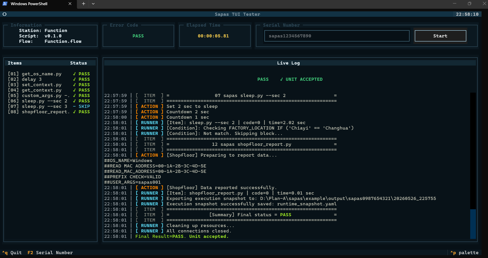

⚠️ **Active Development Notice** This project is under active development. APIs and internal structures may evolve as we continuous align cross-team requirements.

# Sapas

> **Sapas** /sa'baʃ/ — Inspired by the phrase for *"Bravo! Well done!"* Our goal is simple: when a test flow transits from design to factory, it just **PASS**.



## The Problem It Solves: The Cross-Team Fragmentation

In the lifecycle of product development, a destructive cycle often occurs:

1. **RD (Research & Development)** writes their own validation scripts in the lab to bring up the hardware.
2. **TE (Test Engineering)** re-writes completely different automation blocks to fit their test equipment.
3. **PE (Production/Manufacturing)** struggles to deploy a frankenstein framework on the shop floor, resulting in untraceable bugs and heavy maintenance overhead.

**Sapas** is built to break this silo. It is NOT just another "high-performance" runner; it is a **unified testing platform** designed to be the single source of truth from the engineering lab to the continuous assembly line.

---

## Core Philosophy: Unified Architecture

Sapas provides a clean abstraction layer that allows RD, TE, and Factory operators to speak the exact same language:

* **For RD (Lab Verification)**: It acts as a structured environment to write modular `TestItem` blocks using standard protocols (SSH, ADB, UART) without worrying about factory databases or UI rendering.
* **For TE (Deployment & Criteria)**: It separates test logic from standard criteria. TE can shift test limits or sequencing via dynamic configuration files (YAML/CSV) without touching the core code written by RD.
* **For Factory Control (Station Loop)**: It wraps everything into a robust, operator-friendly CLI/TUI environment. It handles continuous looping, serial number inputs, and data hygiene automatically.

---

## Why Sapas?

* \*\*Bridge the Gap\*\*: Stop re-writing scripts. The exact same Python code written during early validation can be directly deployed onto the production line.**Bridge the Gap**: Stop re-writing scripts. The exact same Python code written during early validation can be directly deployed onto the production line.
* **Separation of Concerns**:
  * **RD** controls the **Logic** (How to interact with the device).
  * **TE** controls the **Criteria & Sequence** (What defines a PASS/FAIL and in what order).
  * **Sapas Engine** controls the **Infrastructure** (Logs, UI, data convergence, and hardware connection pools).
* **Defensive by Design**: Implements strict data normalization (e.g., rigid boolean convergence) and contract checking (`opas.var.require`) to prevent laboratory scripts from breaking under harsh factory environments.
* **Aesthetic & Noise-Free CLI**: A unified terminal output powered by `rich`, using balanced visual markers (`✓` / `❌`) ensuring that field technicians can instantly read station health without parsing through raw text noise.

---

## Core Concepts

* **Sequence-Driven Framework**: Test paths are decoupled from implementation. Sequences are orchestrated via configuration files, allowing rapid updates on the shop floor.
* **Unified Result Manager**: Eliminates fragmentation in telemetry. Every single test module feeds into a standardized data model, ensuring tracking stability across all shifts.
* **Multi-Protocol Link Layer**: Built-in support for standard engineering interfaces (**ADB**, **UART**, and **SSH**) so teams don't reinvent connection wrappers.

---

## Installation & Getting Started

To install or update Sapas in editable mode for cross-team development (this automatically updates dependencies such as \`textual\`):To install Sapas in editable mode for cross-team development:

```bash
git pull
pip install -e .
```

## Running the Standard CLI Mode

```bash
sapas --project <YOUR_PROJECT_NAME> --station <STATION_NAME>
```

## Running the Interactive TUI Dashboard (Recommended for Stations)

```bash
sapas --project <YOUR_PROJECT_NAME> --station <STATION_NAME> --tui
```

## Factory/Station Deployment (Recommended)

Alternatively, to avoid typing long arguments, you can pre-define your target environment inside `site_infra.yaml`:

```yaml
# site_infra.yaml(reference /example/Alishan)
PROJECT_NAME: <YOUR_PROJECT_NAME>
STATION_NAME: <STATION_NAME>
```

Execute `sapas` in your project root. See the `Alishan` example for a complete demonstration.

## Advanced Development & Debugging

Single-Step Script Execution (Isolated Testing)

During development or factory-line debugging, you do not need to run the entire station testing loop just to verify a single modification. \*\*Sapas\*\* allows you to execute any individual \`TestItem\` or \`ActionItem\` script independently right from your project root directory.  Simply open your terminal at the project root and pass the filename directly to the \`sapas\` CLI:

```bash
sapas get_os_name.py
```
