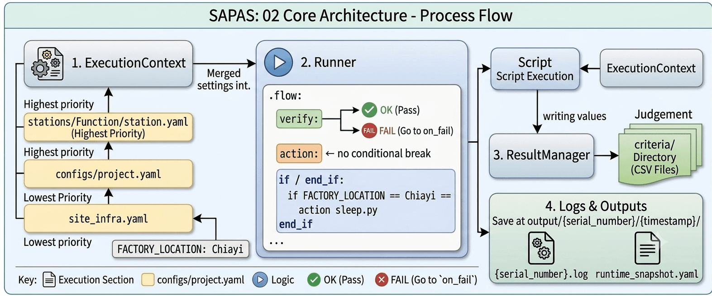

# 02 Core Architecture

The architectural design of Sapas aims to decouple "test logic", "environment configuration", and "connection drivers". We use the `Function` station in `example/Alishan` as an example for explanation.



## 1. ExecutionContext

`ExecutionContext` is the data hub of the entire system. It automatically merges configuration files at startup. The priority is as follows:
`stations/Function/station.yaml` > `configs/project.yaml` > `site_infra.yaml`.

**Example**:
`FACTORY_LOCATION: Chiayi` is defined in `site_infra.yaml`. In `function.flow`, this variable can be used directly for decision-making.

**Variable Access Interface**:
In the future, whether in a **Python Script**, if you want to read or write data, you can achieve it through `sapas.var.get()` and `sapas.var.set()`. It acts as a "global-level" storage space, ensuring data can flow smoothly between different steps.

## 2. Runner

The `Runner` is responsible for parsing `.flow` files. Refer to `example/Alishan/flows/function.flow`:

```yaml
start function
    cycle 1
        verify get_os_name.py           # Execute script and verify result
        delay 3                         # Built-in delay function
        if FACTORY_LOCATION == Chiayi
            action sleep.py --sec 2     # Conditional execution
        end_if
        action demo_logs.py             # Execute log demonstration script
stop

on_fail
    action sleep.py --sec 4             # Rollback mechanism on failure
end
```

### Key Commands:

- `verify`: Immediately interrupts and jumps to `on_fail` upon failure.
- `action`: Executes a task but does not force a result check.
- `if / end_if`: Supports branch judgment based on variables in the `ExecutionContext`.

## 3. ResultManager

When a script is executed, it writes measured values into the system. After the test is completed, `ResultManager` performs judgment based on the CSV files in the `criteria/` directory.

## 4. Logs and Output

Test results are saved in the `output/` directory:
`output/{Serial Number}/{Timestamp}/`

- `runtime_snapshot.yaml`: A snapshot of all variables for that test run.
- `{Serial Number}.log`: Complete execution log.
