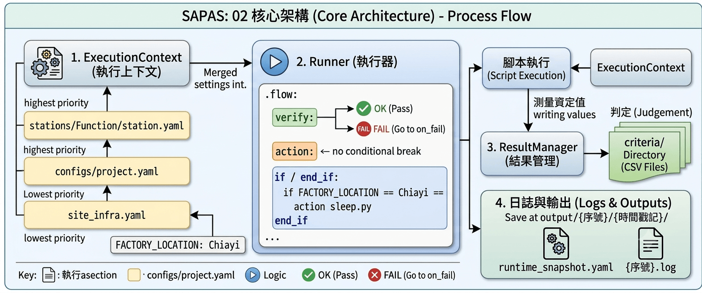

# 02 核心架構 (Architecture)

Sapas 的架構設計旨在分離「測試邏輯」、「環境設定」與「連線驅動」。我們以 `example/Alishan` 的 `Function` 站為例來說明。



## 1. ExecutionContext (執行上下文)

`ExecutionContext` 是整個系統的數據中樞，它會在啟動時自動合併設定檔。優先權如下：
`stations/Function/station.yaml` > `configs/project.yaml` > `site_infra.yaml`。

**範例**：
在 `site_infra.yaml` 中定義了 `FACTORY_LOCATION: Chiayi`。在 `function.flow` 中就可以直接使用這個變數進行判斷。

**變數存取介面**：
日後不論是在 **Python 腳本 (Script)** 中，若想要讀取或寫入數據，都可以透過 `sapas.var.get()` 與 `sapas.var.set()` 來達成。它相當於一個「全域變數級別」的儲存空間，確保數據能在不同步驟間流暢傳遞。

## 2. Runner (執行器)

`Runner` 負責解析 `.flow` 檔案。參考 `example/Alishan/flows/function.flow`：

```yaml
start function
    cycle 1
        verify get_os_name.py                                              # 執行腳本並驗證結果
        delay 3                                                            # 內建延遲功能
        if FACTORY_LOCATION == Chiayi
            action sleep.py --sec 2                                        # 條件判斷執行
        end_if
        action demo_logs.py                                                # 執行日誌演示腳本
        prompt --show usb_disk.png --text "Insert USB"                     # 操作員提示
stop

on_fail
    action sleep.py --sec 4                                                # 失敗時的回退機制
end
```

### 關鍵指令：

- `verify`: 失敗時會立即中斷並跳轉至 `on_fail`。
- `action`: 執行任務但不強制檢查結果。
- `delay`: 內建延遲功能，暫停執行指定秒數。
- `prompt`: 內建操作員提示對話框。支援彈出扁平暗色調視窗以顯示圖片 (`--show`) 與自訂文字說明 (`--text`)，按空白鍵/Enter即可快速確認。在無 GUI 環境下會自動降級為終端機輸入模式。
- `if / end_if`: 支援根據 `ExecutionContext` 中的變數進行分支判斷。

## 3. ResultManager (結果管理)

當腳本執行時，它會將測量值寫入系統。測試結束後，`ResultManager` 會根據 `criteria/` 目錄下的 CSV 檔案進行判定。

## 4. 日誌與輸出

測試結果會保存在 `output/` 目錄下：
`output/{序號}/{時間戳記}/`

- `runtime_snapshot.yaml`: 該次測試的所有變數快照。
- `{序號}.log`: 完整執行日誌。
