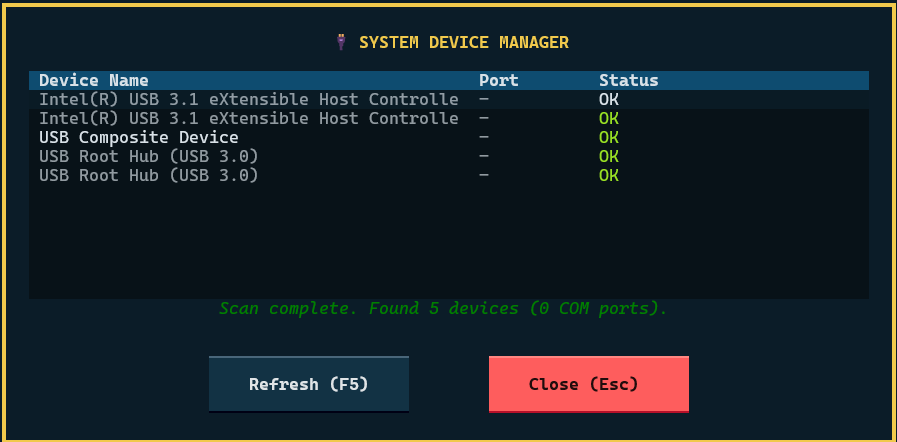
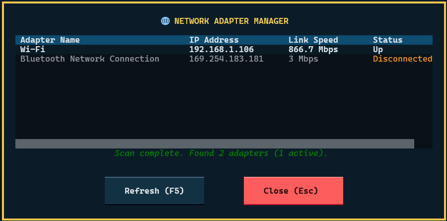

# 09 TUI 儀表板操作與視覺說明書

> **適用對象**：產線操作員、測試工程師、設備整合工程師  
> **介面版本**：Sapas TUI Dashboard v0.1.0+

---

## 1. 介面佈局概述

Sapas TUI 儀表板採用三層垂直式佈局，搭配左右分割的主體內容區，將測試過程中所有關鍵資訊整合在單一終端機畫面中，讓操作員無需切換視窗即可掌握完整的測試狀態。


### 1.1 標題列（Header）

| 元素 | 說明 |
|------|------|
| **Sapas TUI Tester** | 應用程式名稱 |
| **)) Cycle N/N ((** | 目前執行迴圈數 / 總迴圈數（如 `Cycle 1/1`） |
| **HH:MM:SS** | 系統時鐘（24 小時制），顯示於右上角 |

---

### 1.2 頂部狀態看板（Top Status Bar）

頂部分為四個獨立區塊：

#### 📌 Information（資訊欄）
位於左側，顯示目前工位的靜態環境資訊：

| 欄位 | 說明 |
|------|------|
| `Station` | 目前使用的測試工位名稱 |
| `Script` | 測試腳本版本號 |
| `Flow` | 執行中的測試流程檔（`.flow`） |

#### 📌 Error Code（結果狀態）
顯示目前測試的整體判定結果，顏色會隨狀態即時變化（詳見第 2 節）。

#### 📌 Elapsed Time（已耗時）
顯示自測試啟動後的累計秒數（格式：`HH:MM:SS.ss`），用於估算測試進度。

#### 📌 Serial Number + Start（序號輸入與啟動控制）
- **Serial Number 輸入框**：操作員輸入或掃碼待測品序號的欄位，聚焦時顯示黃色外框。
- **Start 按鈕**：輸入序號後，按下 `Enter` 或點擊此按鈕啟動測試流程。

---

### 1.3 主體內容區（Main Body）

主體採用左右分割設計：

#### 左側：Items（測試項目清單）

以斑馬紋格式列出目前工位設定的所有測試項目，包含：

| 欄位 | 說明 |
|------|------|
| `Items` | 測試項目編號與腳本名稱（如 `[01] get_os_name.py`） |
| `Status` | 目前執行狀態（PENDING / RUNNING / PASS / FAIL / SKIP） |

> 測試進行時，RUNNING 中的項目會**自動捲動**至可視範圍內，無需手動操作。

#### 右側：Live Log（即時執行記錄）

以滾動式文字顯示測試引擎的原始輸出，包含：

- `[ ITEM ]`：測試項目邊界分隔線
- `[ RUNNER ]`：測試框架狀態訊息（如快照匯出、資源釋放）
- `[ ACTION ]`：測試腳本中的 `sapas.info()` 業務訊息
- `[ USER ]`：使用者腳本 `print()` 原始輸出
- `[ WARN ]`：非嚴重性警告訊息（黃色顯示）
- `[ ERROR ]`：嚴重性錯誤訊息（紅色顯示）

測試完成後，中央會出現**結果 Banner**（詳見第 2 節），醒目顯示最終判定結果。

---

### 1.4 底列（Footer）

| 區域 | 說明 |
|------|------|
| **左側快捷鍵** | 列出目前可用的鍵盤快捷鍵（如 `^q Quit`、`f2 Serial Number`） |
| **中央狀態列** | 顯示 **SHOPFLOOR ONLINE** 或 **SHOPFLOOR OFFLINE** 連線狀態 |

> ⚠️ **注意**：當 Shopfloor 離線時，底列文字呈紅色，且整個儀表板**外框會變為紅色**，提醒操作員工廠系統目前無法上傳測試結果。

---

## 2. 狀態燈號與視覺語意

### 2.1 測試項目狀態（Items 欄位）

| 狀態標籤 | 顏色 | 意義 | 產線操作指引 |
|----------|------|------|-------------|
| `PENDING` | 灰白色 | 等待執行中，尚未開始 | 正常等待，無需操作 |
| `RUNNING` | 黃色（閃動） | 目前正在執行此步驟 | 請勿移動待測品，勿強制中斷 |
| `✓ PASS` | 亮綠色 | 此步驟測試通過 | 正常，繼續等待 |
| `✗ FAIL` | 紅色 | 此步驟測試失敗 | 測試終止後，依失敗項目判斷維修方向 |
| `- SKIP` | 藍灰色 | 此步驟被跳過（非錯誤） | 正常，通常為條件性跳過或前序失敗導致 |

---

### 2.2 Error Code 整體結果

| 顯示文字 | 顏色 | 意義 | 產線操作指引 |
|----------|------|------|-------------|
| `PASS` | 🟢 亮綠色 | 所有測試步驟均通過 | 貼上 PASS 標籤，放行至下一工站 |
| `CHECK` | 🟡 黃色 | 部分項目需人工確認 | 呼叫測試工程師確認，**不可自行放行** |
| `FAIL` | 🔴 紅色 | 測試失敗，至少一個步驟未通過 | 隔離待測品，依 FAIL 項目填寫不良報告 |

---

### 2.3 Live Log 顏色語意

| 標籤 | 顏色 | 意義 |
|------|------|------|
| `[ ACTION ]` | 白色 | 測試腳本的一般業務資訊 |
| `[ WARN ]` | 🟡 黃色 | 非嚴重性警告，測試繼續執行 |
| `[ ERROR ]` | 🔴 紅色 | 嚴重性錯誤，可能導致後續步驟失敗 |
| `[ RUNNER ]` | 灰藍色 | 測試引擎框架訊息（快照、資源管理） |
| `[ ITEM ]` | 藍白色 | 測試項目邊界分隔線 |
| `[ USER ]` | 預設前景色 | 測試腳本中 `print()` 的原始輸出 |
| `[ DELAY ]` | 青色 | 延遲計時器倒數訊息 |

---

### 2.4 結果 Banner（測試完成後顯示）

測試完成後，Live Log 頂部會出現一個大型 Banner，以邊框顏色與文字雙重提示最終結果：


| Banner 樣式 | 邊框顏色 | 文字顏色 | 意義 |
|-------------|----------|----------|---------|
| `PASS ... UNIT ACCEPTED` | 🟢 綠色 | 🟢 綠色 | 測試通過，單元允許放行 |
| `CHECK ... MANUAL CHECK REQUIRED` | 🟡 黃色 | 🟡 黃色 | 需人工確認後才能判定 |
| `FAIL ... TEST FAILED` | 🔴 紅色 | 🔴 紅色 | 測試失敗，單元不得放行 |

---

## 3. 操作導引

### 3.1 啟動 TUI 儀表板

```bash
# 在工作目錄（如 example/）執行
sapas --tui
```

或指定特定專案與工位：

```bash
sapas --tui --project Alishan --station Function
```

---

### 3.2 標準測試操作流程

```
① 確認底列「SHOPFLOOR ONLINE」（若需 Shopfloor 上報）
         │
         ▼
② 掃描或輸入待測品序號至 Serial Number 輸入框
         │
         ▼
③ 按下 Enter 或點擊 [ Start ] 啟動測試
         │
         ▼
④ 觀察左側 Items 欄位：RUNNING 的項目會自動卷動至畫面
         │
         ▼
⑤ 等待所有項目執行完畢，中央出現結果 Banner
         │
         ▼
⑥ 依 Banner 顏色與文字判斷後續動作（放行 / 維修 / 呼叫工程師）
         │
         ▼
⑦ 掃描下一個待測品序號，進入下一個測試循環
```

---

### 3.3 鍵盤快捷鍵總覽

| 快捷鍵 | 功能 |
|--------|------|
| `Ctrl+Q` / `Ctrl+C` | 請求退出 TUI（彈出確認對話框，預設聚焦於「No」以防誤觸） |
| `F2` | 將輸入焦點移回 Serial Number 輸入框 |
| `F3` | 切換 UI 佈景主題（Theme Cycle） |
| `F4` | 開啟 / 關閉 Device Manager（裝置管理器）覆蓋視窗 |
| `F6` | 開啟 / 關閉 Network Adapters（網路介面卡管理）覆蓋視窗 |
| `Y` / `N` / `Escape` | 退出確認對話框中的快速鍵回應 |

---

### 3.4 退出儀表板

按下 `Ctrl+Q` 或 `Ctrl+C` 後，畫面中央會出現確認對話框：


- **預設焦點落在「No」**（帶有白色外框）：防止操作員在測試中誤按 `Enter` 而中斷測試。
- 按 `Y` 確認退出，按 `N` 或 `Escape` 返回測試畫面，無需動滑鼠。

> ⚠️ **警告**：若在測試進行中退出，當前測試項目將**於執行完畢後停止**，測試結果不會被完整上報至 Shopfloor。

---

### 3.5 Device Manager（裝置管理器）

按下 `F4` 可開啟 System Device Manager 覆蓋視窗，掃描並列出目前連接的裝置清單：



| 欄位 | 說明 |
|------|------|
| `Device Name` | 裝置名稱（如 USB Controller、COM Port） |
| `Port` | 對應的通訊埠號（若無則顯示 `—`） |
| `Status` | 裝置狀態（`OK` 綠色 / 異常紅色） |

- **Refresh (F5)**：重新掃描所有裝置，適合在接上新硬體後使用。
- **Close (Esc)**：關閉視窗，返回主儀表板。

---

### 3.6 Network Adapter Manager（網路介面管理器）

按下 `F6` 可開啟 Network Adapter Manager 覆蓋視窗，掃描並列出目前所有網路介面的狀態：



| 欄位 | 說明 |
|------|------|
| `Adapter Name` | 網路介面名稱（如 Wi-Fi、Ethernet） |
| `IP Address` | 目前取得的 IP 位址 |
| `Link Speed` | 連線速率（如 `866.7 Mbps`） |
| `Status` | 連線狀態（`Up` 白色 / `Disconnected` 橘色） |

- **Refresh (F5)**：重新掃描網路介面清單。
- **Close (Esc)**：關閉視窗，返回主儀表板。

> 💡 **提示**：若 Shopfloor 顯示離線，可先至此確認網路介面 IP 是否正確取得。

---

## 4. Shopfloor 連線狀態說明

| 外框顏色 | 底列訊息 | 意義 | 注意事項 |
|----------|----------|------|----------|
| 🟢 綠色外框 | `SHOPFLOOR ONLINE` | Shopfloor 系統連線正常 | 測試結果將自動上報 |
| 🔴 紅色外框（閃爍） | `SHOPFLOOR OFFLINE` | 無法連線至 Shopfloor | 測試結果**不會**自動上報，請通知 IT 或測試工程師排查 |

---

## 5. 常見問題與處理

| 現象 | 可能原因 | 建議處理方式 |
|------|----------|-------------|
| 整體外框紅色閃爍 | Shopfloor 系統離線 | 聯絡 IT 確認網路或 Shopfloor 服務 |
| 特定項目顯示 `SKIP` | 前置步驟失敗或條件性跳過 | 確認 FAIL 的步驟並排查根本原因 |
| `Error Code` 顯示 `CHECK` | 部分測試結果需人工目視確認 | 呼叫測試工程師，不可自行放行 |
| Start 按鈕無法按下 | 序號欄位為空，或測試正在進行中 | 確認已輸入序號，或等待目前測試結束 |
| Live Log 訊息超出畫面 | Log 內容過多 | 可使用滾動條查看歷史記錄，下次測試後自動清空 |
